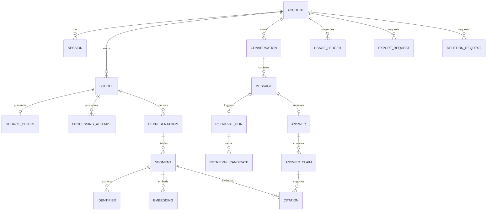

# Data Model and Provenance

Status: Proposed for approval

## Principles

- UUID identifiers are opaque externally.
- Every tenant-owned table carries `account_id`.
- Original objects and derived representations are immutable and versioned.
- Soft deletion immediately removes data from active use; asynchronous purge removes durable artifacts.
- Vectors are derived data in PostgreSQL, never the canonical content.

## Entity model



## Important records

- `Source`: type, title, declared/detected MIME, original language, lifecycle state, active processing version, timestamps.
- `SourceObject`: optional for note sources; opaque object key, checksum, byte size, media duration, object version and encryption metadata for audio/documents.
- Plain-text notes store their immutable submitted body as an `original_text` representation in PostgreSQL with a canonical UTF-8 content hash. Exports materialize it as a UTF-8 text file; provenance resolves to the representation rather than an object-store row.
- `ProcessingAttempt`: workflow version, stage, attempt, status, lease/error and timings.
- `Representation`: original text, transcript, or English-normalized text; processor/model version and derivation link.
- `Segment`: original/normalized offsets, page/paragraph data, or audio start/end milliseconds.
- `Identifier`: normalized token and kind linked to a segment; no user-facing tag model.
- `Embedding`: model, dimensions, input hash and vector. A model migration writes a parallel version before cutover.
- `RetrievalCandidate`: channel scores, fused/reranked score and selected status for audit/evaluation.
- `AnswerClaim` and `Citation`: structured claim-to-segment mapping and validation result.
- `UsageLedger`: immutable reserve/commit/release entries keyed to operation IDs.
- `Job`: durable payload reference, state, priority, attempts, availability, lease and error code.

## Provenance invariant

Every displayed citation resolves:

```text
citation -> answer claim -> immutable segment -> representation version
         -> owned source -> immutable original object
                         OR immutable submitted-note representation + hash
```

Normalized representations carry alignment to original segments. A citation never points only to a translation or embedding.

## Deletion classification

Deleting a source immediately tombstones it and then:

- purges source objects, representations, segments, identifiers, embeddings and processing payloads;
- removes retrieval candidates and evaluation payloads containing its text;
- invalidates citations to it, removes affected claims, and redacts quoted evidence from persisted answers;
- atomically marks the entire answer unavailable when any remaining substantive claim lacks at least one active supporting citation; an unavailable answer is never displayed as factual output;
- retains only content-free audit facts, tombstone/deletion-ledger entries, usage ledger entries and job outcome metadata required for security/accounting;
- removes or redacts conversation messages only when they contain copied source evidence; user-authored questions remain unless the account is erased.

Foreign keys and purge handlers implement this classification explicitly rather than relying on an unrestricted cascade.

## Index strategy

- B-tree indexes begin with `account_id` for owned lookups.
- Unique `(account_id, idempotency_key, operation_type)` constraints prevent duplicate mutations.
- PostgreSQL full-text indexes cover original and normalized searchable text.
- Normalized identifier indexes support exact matching.
- pgvector HNSW is used after representative data exists; query filters always include account and ready/active state.
- Partial indexes exclude deleted and unpublished source versions.
