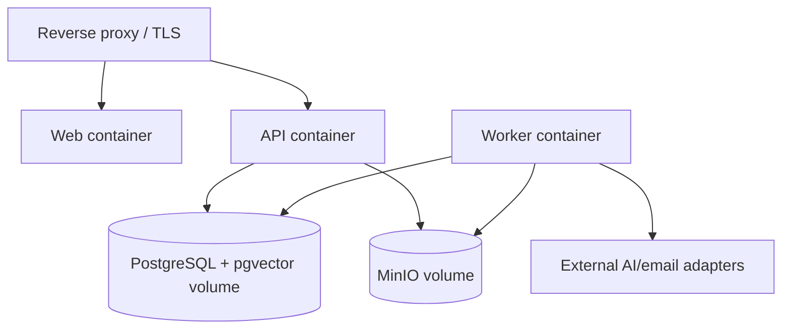

# Deployment, Docker, and Operations

Status: Proposed for approval

## Managed launch recommendation

| Concern | Recommended launch service | Reason |
| --- | --- | --- |
| Web | Vercel Pro | Static/global delivery and preview deployments |
| API + worker | Render Docker services in Singapore | Docker support, Singapore region and distinct background workers |
| PostgreSQL/vector | Supabase Pro in Singapore | Managed PostgreSQL, pgvector capability and backups |
| Object storage | Supabase Storage | S3-compatible API and proximity to database |
| Android builds | Expo EAS initially | Reproducible Android signing/build workflow; local/CI build remains possible |
| AI/email | Provider adapters | Selected separately and replaceable |

Render documents Docker deployment, background workers and a Singapore region. Supabase offers a Singapore region and S3-compatible storage. See [Render Docker](https://render.com/docs/docker), [Render regions](https://render.com/docs/regions), [Render workers](https://render.com/docs/background-workers), [Supabase regions](https://supabase.com/docs/guides/platform/regions), and [Supabase Storage](https://supabase.com/docs/guides/storage).

Vercel hosts only the web application. Long-running FastAPI ingestion and worker processing do not run as Vercel functions.

## Self-hosted Docker profile

Compose supplies web, API, worker, migrations, PostgreSQL/pgvector, MinIO and reverse proxy. Production secrets are injected, never committed. Durable volumes have documented backup targets. The migration job runs once before compatible API/worker rollout.

## Container requirements

- Pinned minimal base images, non-root user, read-only root filesystem where practical, dropped capabilities and no embedded secrets.
- Multi-stage builds and dependency lock files.
- Liveness checks process health; readiness checks required dependencies without exposing details.
- API and worker use the same immutable image with different commands.
- Web runtime configuration does not require rebuilding secrets into static assets.
- Images are scanned and signed in CI; deployments reference immutable digests.

## Availability and recovery proposals

- Launch service target: 99.5% monthly API availability, excluding announced maintenance.
- API p95 target: 500 ms for non-AI/non-upload endpoints under defined launch load.
- Question processing target: p95 20 seconds; submission returns the answer synchronously only if validated within that window, otherwise `202` with the idempotent answer status resource.
- Ingestion target: 95% of valid 30-minute audio ready within 10 minutes, provider capacity permitting.
- RPO: 24 hours for PostgreSQL and object metadata at launch.
- RTO: 8 hours for managed launch and self-hosted documented recovery.
- Restore drill: before production, quarterly thereafter; verify database, object manifests, provenance and deletion-expiry behavior.

These targets require product-owner approval and load testing before being treated as SLOs.

## Observability

Use structured logs, metrics and traces with request ID, account hash/pseudonym, source/job/retrieval IDs, stage, provider/model version, latency, retry classification and token/usage counts—never content. Monitor error rate, queue age, dead letters, ingestion latency, provider failures, refusal rate, citation validation failures, quota anomalies, backup age and restore results.

## Operational runbooks

Required before launch: provider outage, stuck queue, storage/database outage, credential rotation, data breach, backup restore, deletion failure, model rollback, embedding migration, cost spike and regional service failure.
