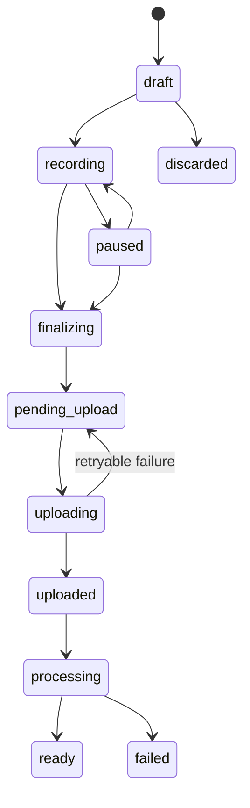

# Web and Android Architecture

Status: Proposed for approval

## Monorepo

Use pnpm workspaces:

```text
apps/web/              React web application
apps/mobile/           Expo/React Native Android application
packages/api-client/   Generated OpenAPI client and types
packages/domain/       Framework-free client state/value types
packages/validation/   Shared request/input validation
packages/i18n/         English and Filipino UI resources
packages/testing/      Shared fixtures and contract helpers
packages/config/       TypeScript/lint/test configuration
```

Do not force universal UI. Web and mobile own their routing, accessibility primitives, recording integrations, and presentation. Share contracts and non-UI logic.

## Web

- React SPA deployed as static assets.
- TanStack Query owns server state; forms and local state remain component-scoped.
- Generated OpenAPI client is the only API transport layer.
- Secure session cookies are preferred; no tokens in local storage.
- Web supports text/file capture, source lifecycle, questions, citations, export, delete and usage views. Browser audio capture is optional and does not claim background reliability.

## Android

- Expo/React Native with development/native builds; Expo Go is insufficient for the required foreground microphone service.
- `expo-audio` background recording uses an Android foreground service and persistent notification.
- Device-private document storage holds application-encrypted active recordings; an encrypted SQLite database holds the durable outbox. An OS-keystore-protected, non-exportable application key wraps data keys. Losing the device/key makes pending local data unrecoverable; uploaded server copies are unaffected.
- Secure Store holds refresh credentials; sensitive content is excluded from analytics and crash logs.
- Background upload is eventual and OS-controlled. UI always exposes pending/retry state and never promises immediate sync after process termination.

### Recording and upload state



Local metadata includes UUID, checksum, timestamps, duration, media format, retry count, upload session and last error. The app auto-stops at the configurable 30-minute limit; the server rechecks duration. Local audio is removed only after durable server acceptance and the approved cleanup window.

Encryption tests verify ciphertext at rest, key unavailability after logout/account removal, failure-safe handling when the keystore is unavailable, and cleanup of wrapped keys and pending files. Android backup rules exclude pending recordings, the outbox database, and application keys.

## Driving-safety experience

- Permissions and setup happen before driving.
- One dominant start/stop control, large pause/resume control, haptic/audio confirmation, elapsed-time announcement, and notification controls.
- No transcript review, reading, search, or multi-step navigation while recording mode is active.
- No wake-word or Android Auto claim in MVP.

## Citation experience

Answers contain numbered claim-level markers. Citation details show original source title/type, original-language evidence, and the most precise location available. Audio seeks to a timestamp; documents open a page/passage when reliable and offer the original. English-normalized text is visibly labeled as derived. Deleted or unavailable sources fail safely.

## Accessibility target

Proposed target: WCAG 2.2 AA for web plus equivalent mobile semantics, TalkBack, font scaling, contrast, reduced motion, and minimum 44-by-44 CSS-pixel / 48-dp touch targets. Driving flows require physical-device testing, not only automated scans.

## Testing

- Shared state-machine and contract tests.
- Component tests for every queued/offline/failed/quota/refusal/citation state.
- MSW integration tests and Playwright web E2E with keyboard/a11y scans.
- React Native Testing Library plus emulator and physical-device tests for permissions, lock screen, interruption, offline restart, duplicate upload, low storage, font scaling and TalkBack.
