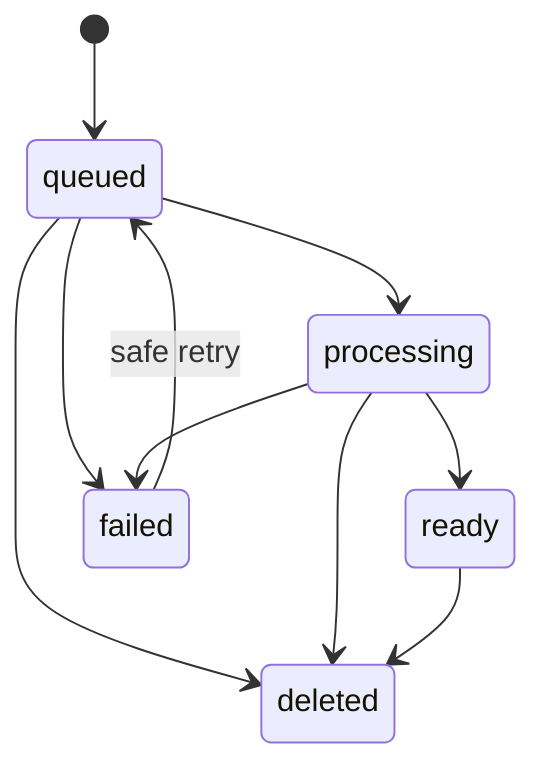

# Ingestion and Content Processing

Status: Proposed for approval

## User-visible lifecycle



## Internal stages

```text
accepted -> original_stored -> validated
-> extracted_or_transcribed -> language_detected
-> normalized -> segmented -> identifiers_indexed
-> embedded -> published_ready
```

Each handler is keyed by `(source_id, workflow_version, stage)` and may be delivered more than once. Required artifacts publish atomically by switching `active_processing_version` only after completion.

## Upload protocol

1. Client supplies metadata, checksum, declared size and idempotency key.
2. In one transaction, the API validates entitlement, reserves the declared upload/storage allowance, and creates the source/upload session. Concurrent sessions see committed reservations.
3. Client uploads directly using short-lived scoped storage authorization.
4. Completion verifies object existence, checksum, actual size, media duration and owner.
5. In one transaction, completion adjusts the reservation to verified usage, moves the source to queued and inserts the first job. Insufficient allowance after an invalid declaration rejects completion and schedules object cleanup.

Upload reservations expire after 24 hours. Expiry, discard, permanent validation failure and cleanup release the reservation exactly once. Transient processing retries retain the committed ingestion/storage charge and never create another charge. Billable transcription/generation uses separate operation reservations committed from measured provider usage or released on non-billable failure.

Twenty-five-megabyte documents may use a signed single upload. Android audio uses resumable/multipart upload when the selected storage adapter supports it; otherwise whole-file retry is explicit and restart-safe.

## File safety

- Allow-list extension, detected MIME and file signature; never trust client MIME.
- Sanitize display filenames and use opaque storage keys.
- Reject encrypted/password-protected and corrupt documents with safe error codes in MVP.
- Limit parser CPU, memory, recursion, archive expansion and output size.
- Run document parsing in a constrained worker process/container profile.
- Proposed launch requirement: malware scanning before content becomes ready.
- Scanned-PDF OCR is not included until explicitly approved; detect and report unsupported image-only PDFs.

## Language handling

Preserve the original text/transcript. Detect English, Filipino or mixed language per segment. Create a separate English-normalized version for cross-language retrieval and maintain alignment back to original offsets/timestamps. Store processor and model versions.

## Failure and reconciliation

- Transient provider/network errors retry with bounded exponential backoff and jitter.
- Permanent input/provider errors enter a user-visible failed state.
- Exhausted jobs enter dead-letter state and alert operations.
- A reconciliation job finds stored originals without queued work, expired leases, incomplete publication and orphan artifacts.
- Stage-specific AI reservations commit measured billable usage or release/refund according to the plan policy; storage/ingestion reservation behavior follows the upload protocol above, and retry delivery never double-charges.

## Deletion race

Deletion synchronously tombstones the source, revokes active upload/download access, and excludes it from retrieval. Workers and answer finalization recheck the tombstone before every external call, write and response. Purge follows the exhaustive classification in `data-model.md`, including identifiers, candidates, quoted answers/claims and citations—not only objects and vectors. Backup expiry completes within 30 days.

Reprocessing in MVP is an internal/admin recovery action for changed parsers/models, not a user editing feature. It creates a new immutable version, validates it, atomically switches the active version, invalidates cached retrieval, and preserves old citation resolution only until the old version is safely retired. User-visible correction requires a new source.
