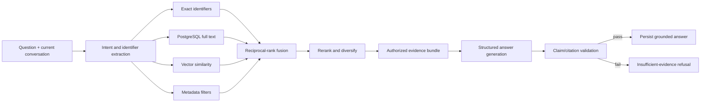

# Retrieval, RAG, Citations, and Refusal

Status: Proposed for approval

## Pipeline

All retrieval channels filter by authenticated account, ready state and active version before candidates reach a model. Current conversation helps interpret follow-ups but is not factual evidence.

## Retrieval channels

- Exact normalized identifiers such as `JIRA-100` receive a controlled boost, not automatic truth.
- PostgreSQL full-text search covers original and English-normalized text.
- Metadata filters constrain source type, time or explicitly inferred attributes.
- pgvector similarity searches versioned original/normalized embeddings.
- Reciprocal-rank fusion avoids assuming score scales are comparable.
- A replaceable reranker scores a bounded fused set; adjacent segments are merged and sources diversified.

## Answer contract

The generator receives only system instructions, the question/context, and an evidence bundle of opaque segment IDs plus text. Uploaded instructions are delimited as untrusted evidence. It returns structured claims, supporting segment IDs, uncertainty and conflicts. It has no tools, storage credentials or access to unretrieved sources.

Question submission is always idempotent and creates an `Answer` operation with a usage reservation. The API may hold the request for up to 20 seconds; if unfinished it returns `202` and the same answer status resource used by clients for polling. Worker or API execution uses the same leased operation contract, timeout and cancellation flag. Only a fully validated answer becomes visible. Timeout, refusal and non-billable failure commit or release usage according to measured provider consumption; retry never duplicates the operation.

## Proposed evidence/refusal policy

An answer passes only when:

1. At least one authorized, active segment survives retrieval thresholds.
2. Exact, lexical and semantic channel thresholds are calibrated per channel and versioned.
3. Every substantive claim maps to at least one segment in the supplied evidence bundle.
4. A grounding evaluator finds support for each claim; unsupported claims are removed or the answer is refused.
5. Conflicting evidence is explicitly described and both sides cited; otherwise refuse.
6. Citation locators resolve to original evidence at response time.

Numerical thresholds are not hard-coded in architecture. Before launch, a labeled English/Filipino/mixed-language corpus must meet these proposed gates:

- cross-user leakage: exactly 0 observed cases
- citation source/locator precision: at least 98%
- substantive claim support rate: at least 98%
- no-answer false-answer rate: at most 2%
- exact-identifier retrieval recall@10: at least 99%
- overall answerable-query retrieval recall@10: at least 90%

Changes to the policy or thresholds are versioned, evaluated, and auditable.

Only messages whose `conversation_id` equals the addressed, authorized conversation may enter follow-up context. Prior conversations and other users' messages are excluded by query shape and adversarial tests.

## Citation resolution

A citation stores source ID/version and immutable segment ID. The resolver re-authorizes ownership and active state, then returns original-language evidence and a short-lived original-object URL when requested. Location is a tagged union:

- audio: start/end milliseconds
- PDF: page plus passage when reliable
- DOCX/Markdown/TXT/note: section/paragraph/character range plus passage

When precision is unavailable, the UI truthfully degrades to source-level location.

## Evaluation corpus

Include exact identifiers across modalities, semantic paraphrases, Filipino/English code-switching, conflicting/stale/deleted evidence, ambiguous IDs, follow-ups, weak/no evidence, prompt injection, corrupt provenance, and cross-user planted matches. Evaluate retrieval and citation correctness separately from prose quality.
