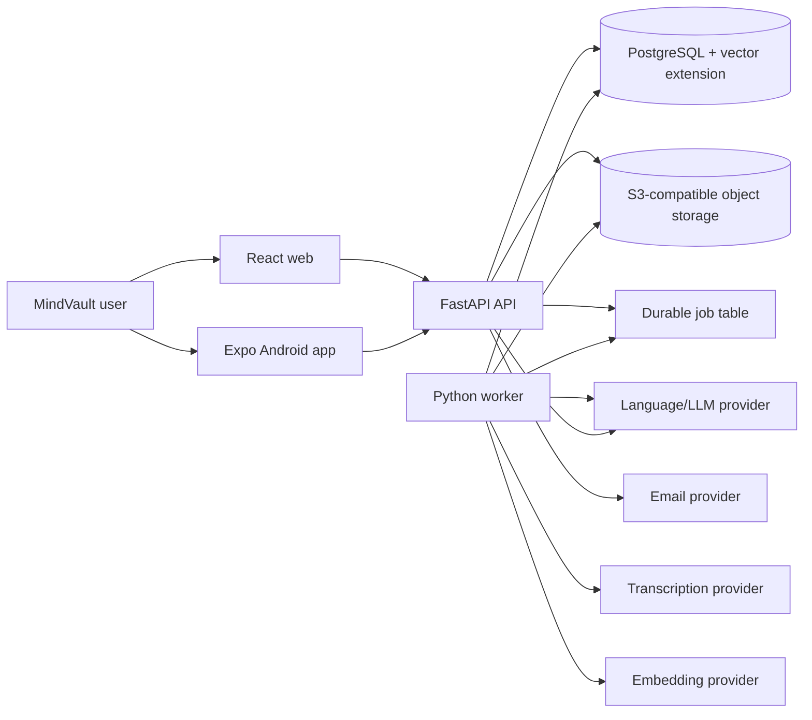

# System Overview

Status: Proposed for approval

## Architectural style

MindVault is a modular monolith delivered as separate API and worker processes from one Python codebase. PostgreSQL is the system of record and retrieval store. S3-compatible object storage holds immutable originals and generated exports. Web and Android clients consume a versioned HTTP API.

This shape keeps transaction, authorization, provenance, and deployment boundaries clear without introducing distributed services before scale requires them.

## Context



External AI and email systems are processors behind application-owned ports. They never become sources of truth.

## Runtime components

| Component | Responsibility | Durable state |
| --- | --- | --- |
| Web | Capture text/files, browse sources, ask questions, inspect citations, export/delete | Browser session only |
| Android | Safe audio capture, encrypted local outbox, deferred upload, web-equivalent knowledge flows | Device-private files and SQLite outbox |
| API | Authentication, authorization, commands, queries, upload coordination, retrieval and grounded answers | PostgreSQL/object storage |
| Worker | Extraction, transcription, normalization, chunking, embedding, export and deletion jobs | PostgreSQL/object storage |
| PostgreSQL | Accounts, sessions, metadata, derived text, provenance, conversations, jobs, usage, vectors | Primary durable store |
| Object storage | Original audio/files and export archives | Primary binary store |

## Core data flow

```mermaid
sequenceDiagram
    participant C as Client
    participant A as API
    participant O as Object storage
    participant D as PostgreSQL
    participant W as Worker
    participant AI as AI providers

    C->>A: Create source/upload (idempotency key)
    A->>D: Reserve upload/storage allowance and create source
    A-->>C: Scoped upload instruction
    C->>O: Upload immutable original
    C->>A: Complete upload with checksum
    A->>D: Verify metadata, adjust reservation + enqueue durable job
    W->>D: Lease job
    W->>O: Read original
    W->>AI: Transcribe/normalize/embed through ports
    W->>D: Store versioned representations and provenance
    W->>D: Atomically publish source as ready
    C->>A: Ask question (reserve allowance)
    A->>D: Authorized hybrid retrieval
    A->>AI: Evidence-bounded generation
    A->>D: Persist claims and citations
    A-->>C: Grounded answer or refusal; commit/release allowance
```

## Trust boundaries

- Internet clients are untrusted.
- Uploaded content is untrusted data, including instructions embedded in documents.
- Object-store credentials, signed URLs, provider keys, and model inputs are sensitive.
- Authorization is enforced before database access, job execution, object access, model input, citation resolution, export, and deletion.
- AI output is untrusted until schema, evidence membership, and claim-citation checks pass.

## Deployment profiles

- Managed launch: Vercel web; container host in Singapore for API and worker; Supabase Singapore for PostgreSQL and object storage; managed email and AI providers.
- Self-hosted: Docker Compose with web, API, worker, PostgreSQL/pgvector, MinIO, and reverse proxy. External AI/email remain configurable; local adapters may be added later without changing domain logic.
- Android is a signed application artifact, not a Docker service.

## Architecture gate

Implementation may start after the ADRs and architecture quality targets are approved. Specific AI adapters and commercial allowances may be selected in a separately approved provider-evaluation task before features that depend on them; provider selection does not reopen core architecture.
